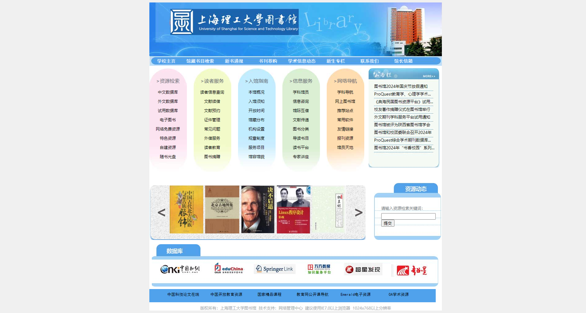

# 说明

这是上海理工大学`Java Web`课程的平时作业的代码，供学弟学妹们参考

## 作业一

写一个如下图的网页

效果在http://localhost:8080/javaWeb_war_exploded/hello-servlet

## 作业二

用户注册,输入用户名，密码（两次一致，后端要验证）,性别，年龄，输出注册结果，并显示当前所有注册用户的所有详细信息。不得有服务器I/O

效果在：

http://localhost:8080/javaWeb_war_exploded/jsp/index.jsp

## 作业三

编写一个页面jsp，显示当前所有学生的成绩信息(数据动态)，包括  

学号，姓名，专业，平时成绩50%，期末成绩50%，总成绩  

  01     张三   计算机      80                     90                      85          delete(链接servlet) 

其中平时成绩，期末成绩和总成绩是文本框一个提交按钮：点击提交后，会保存所有成绩(一个servlet)一个新增链接（按钮），点击显示新页面，显示录入新的学生信息界面jsp（学号，姓名，专业，成绩初始0）,可以录入新的学生信息(servlet)。 要求：分层开发，servlet负责业务逻辑，不处理界面。jsp负责界面。     数据保存到内存里面，不做外部IO

效果在：

http://localhost:8080/javaWeb_war_exploded/jsp/student.jsp

## 作业四